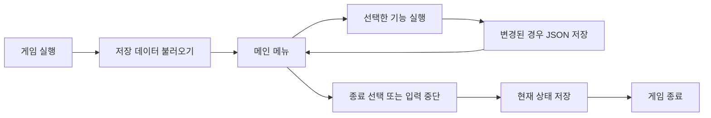

# E1-2 나만의 퀴즈 게임

## 프로젝트 개요

터미널에서 4지선다형 상식 문제를 풀고, 새로운 문제를 직접 추가하거나 삭제할 수
있는 Python 퀴즈 게임이다. 익숙한 상식 문제를 주제로 사용해 Python 기본 문법,
객체별 역할 분리와 JSON 파일 입출력 구현에 집중했다.

게임을 시작하면 저장된 전체 문제 중 풀 문제 수를 선택하고, 선택한 수만큼 문제가
중복 없이 무작위로 출제된다. 각 문제의 제한 시간은 10초이며 5초가 지나면 힌트가
자동으로 공개된다.

- 힌트가 공개되기 전에 맞히면 3점
- 힌트가 공개되면 정답 점수에서 2점을 차감해 1점
- 오답 또는 시간 초과는 0점
- 각 문제의 정오답 안내 뒤에 현재 누적 점수 표시
- 완료한 플레이 중 가장 높은 실제 획득 점수를 최고 점수로 저장

기본 상식 문제 5개를 제공하며 퀴즈, 최고 점수와 플레이 기록은 프로젝트 루트의
`state.json`에 저장된다. 따라서 프로그램을 종료하고 다시 실행해도 이전 상태가
유지된다.

## 프로젝트 구조

```text
.
├── main.py
├── src/
│   ├── __init__.py
│   ├── quiz.py
│   ├── game_manager.py
│   ├── state_manager.py
│   ├── timed_input.py
│   └── default_quizzes.py
├── state.json
├── README.md
├── docs/
│   ├── architecture-plan.md
│   ├── requirements.md
│   ├── progress.md
│   ├── worklog.md
│   └── troubleshooting.md
└── evidence/
    ├── git/
    ├── logs/
    └── screenshots/
```

## 객체와 파일의 역할

| 파일 | 책임 |
|---|---|
| `main.py` | 필요한 객체를 생성하고 게임을 시작하는 진입점 |
| `src/quiz.py` | `Quiz` 데이터 검증, 문제 출력, 정답 확인과 JSON 변환 |
| `src/game_manager.py` | 메뉴, 입력, 퀴즈 진행, 문제 추가·삭제와 점수 처리 |
| `src/state_manager.py` | JSON 저장·검증·백업과 손상 파일 복구 |
| `src/timed_input.py` | 제한 시간 답 입력, 카운트다운과 자동 힌트 처리 |
| `src/default_quizzes.py` | 상태 파일이 없거나 손상됐을 때 사용할 기본 문제 제공 |

### `Quiz`

퀴즈 한 문제를 표현한다. 문제, 선택지 4개, 정답 번호와 힌트를 보관하고 데이터
형식을 검증한다. 문제 출력, 정답 확인과 JSON 변환도 담당한다.

### `GameManager`

사용자와 상호작용하는 게임 흐름을 담당한다. 메뉴와 입력 검증, 퀴즈 플레이,
문제 추가·목록·삭제와 점수 기록을 처리한다.

### `StateManager`

게임 상태 파일을 담당한다. `GameManager`에서 퀴즈·최고 점수·플레이 기록을 전달받아
JSON으로 저장하고, 프로그램 시작 시 같은 세 값을 복원한다. 파일 검증과 손상 복구도
한곳에서 처리한다. 기본 퀴즈는 상태 파일이 없거나 손상됐을 때만 생성한다.

### `TimedTerminalInput`

일반 메뉴 입력과 달리 시간이 흐르는 동안 답을 기다려야 하는 기능을 담당한다.
10초 제한 시간, 1초 카운트다운, 5초 후 자동 힌트와 시간 초과 입력 정리를 처리한다.

## 개발 환경과 실행 방법

- 기준 환경: macOS, zsh
- Python 3.12.13 사용, Python 3.10 이상 지원
- Git 2.53.0
- 외부 라이브러리 없이 Python 표준 라이브러리만 사용

프로젝트 루트에서 실행한다.

```zsh
python3 main.py
```

기본 실행은 실제 게임 데이터인 `state.json`을 사용한다. 실제 데이터를 변경하지 않고
기능을 확인하려면 테스트 모드로 실행한다.

```zsh
python3 main.py --test
```

`--test` 옵션은 Git에서 제외된 `state.test.json`만 읽고 쓴다. 옵션 없이 실행하면
실제 데이터인 `state.json`을 사용한다.

## 주요 기능

### 필수 기능

| 기능 | 설명 |
|---|---|
| 메뉴 | 퀴즈 풀기, 목록, 점수, 추가, 삭제와 종료 기능을 선택한다. |
| 퀴즈 풀기 | 저장된 상식 문제 중 원하는 문제 수를 선택해 푼다. |
| 퀴즈 추가 | 문제, 선택지 4개, 정답 번호와 힌트를 입력해 즉시 저장한다. |
| 퀴즈 목록 | 현재 저장된 모든 문제의 번호와 질문을 확인한다. |
| 최고 점수 | 지금까지 획득한 가장 높은 점수와 최근 플레이 기록을 확인한다. |
| 입력 검증 | 빈 입력, 문자와 범위를 벗어난 숫자를 안내하고 다시 입력받는다. |
| 안전 종료 | 정상 종료, `Ctrl+C`, EOF에서 가능한 상태를 저장하고 종료한다. |
| JSON 영속성 | 퀴즈, 최고 점수와 플레이 기록을 종료 후에도 유지한다. |
| 손상 복구 | 손상된 JSON을 백업하고 기본 데이터로 실행을 복구한다. |

### 추가 기능

| 기능 | 설명 |
|---|---|
| 무작위 출제 | 원본 저장 순서를 바꾸지 않고 선택한 문제를 무작위로 출제한다. |
| 문제 수 선택 | 1개부터 전체 문제 수까지 원하는 풀이 수를 선택한다. |
| 제한 시간 | 문제마다 10초 제한 시간과 1초 단위 카운트다운을 제공한다. |
| 자동 힌트 | 5초가 지나면 문제별 힌트를 자동으로 공개한다. |
| 힌트 점수 차감 | 정답에 3점을 더하고 힌트가 공개된 정답은 2점을 차감한다. |
| 현재 점수 | 각 문제의 정답·오답·시간 초과 안내 뒤에 누적 점수를 표시한다. |
| 퀴즈 삭제 | 문제를 선택하고 `y/n`으로 확인한 뒤 즉시 저장한다. |
| 플레이 기록 | 플레이 시각과 점수를 저장하고 최근 5개를 최신순으로 보여준다. |

## 전체 게임 흐름



게임은 저장된 상태를 복원한 뒤 메뉴를 반복한다. 조회 기능은 바로 메뉴로 돌아오고,
퀴즈 추가·삭제 또는 플레이처럼 상태가 바뀌는 기능은 JSON 저장 후 메뉴로 돌아온다.
종료 메뉴, `Ctrl+C` 또는 EOF가 발생하면 가능한 현재 상태를 한 번 더 저장하고
프로그램을 종료한다.

| 메뉴 | 수행 기능 | 상태 파일 처리 |
|---|---|---|
| 1. 퀴즈 풀기 | 문제 수 선택, 무작위 출제, 제한 시간 답 입력과 현재 점수 표시 | 결과와 최고 점수 저장 |
| 2. 퀴즈 목록 보기 | 저장된 질문 목록 출력 | 변경 없음 |
| 3. 최고 점수와 기록 | 최고 점수와 최근 기록 5개 출력 | 변경 없음 |
| 4. 퀴즈 추가 | 입력 검증 후 새 `Quiz` 추가 | 즉시 저장, 실패 시 추가 취소 |
| 5. 퀴즈 삭제 | 문제 번호와 `y/n` 확인 후 삭제 | 즉시 저장, 실패 시 삭제 취소 |
| 6. 종료 | 현재 상태 저장 시도 후 종료 | 최종 저장 |

## 데이터 저장

### 파일 경로와 용도

| 파일 | 용도 | Git 추적 |
|---|---|---|
| `state.json` | 실제 퀴즈, 최고 점수와 플레이 기록 | 추적 |
| `state.test.json` | 동료평가와 직접 기능 확인용 상태 | 제외 |
| `*.json.bak` | 교체 직전의 마지막 정상 상태 한 세대 | 제외 |
| `*.corrupt-*` | 손상 복구 전에 보존한 원본 상태 | 제외 |

상태 파일 경로는 현재 터미널 위치가 아니라 프로젝트 루트를 기준으로 계산한다.
JSON은 UTF-8, 한글 유지, 들여쓰기 4칸 형식으로 저장한다.

### JSON 스키마

```json
{
  "quizzes": [
    {
      "question": "문제 내용",
      "choices": ["선택지 1", "선택지 2", "선택지 3", "선택지 4"],
      "answer": 1,
      "hint": "문제별 힌트"
    }
  ],
  "best_score": 7,
  "score_history": [
    {
      "played_at": "2026-08-05 21:34",
      "score": 4
    }
  ]
}
```

- `quizzes`: 퀴즈 객체 목록
- `best_score`: 아직 플레이하지 않았으면 `null`, 이후 가장 높은 실제 획득 점수
- `score_history`: 완료한 플레이의 시각과 점수 기록
- `answer`: 1부터 4 사이의 정답 번호
- `played_at`: `YYYY-MM-DD HH:MM` 형식의 로컬 시각

### 파일 없음과 손상 복구

- 정상 파일: 퀴즈·최고 점수·플레이 기록을 복원한다.
- 파일 없음: 기본 퀴즈 5개와 빈 점수 기록으로 새 상태를 만든다.
- 정상 저장: 교체 직전의 정상 활성 파일을 `*.json.bak`에 한 세대 보관한다.
- 손상 파일: 원본을 별도 파일로 보존한 뒤 마지막 정상 백업을 우선 복구한다.
- 정상 백업 없음·손상: 기본 데이터로 복구한다.
- 백업 실패: 손상 원본을 보호하기 위해 해당 실행의 저장을 중지한다.

새 상태와 정상 백업은 각각 임시 파일을 먼저 만든 뒤 대상 파일로 교체한다. 활성
파일이 손상된 경우에는 마지막 정상 백업을 덮어쓰지 않는다. 퀴즈 추가·삭제 또는
플레이 기록 저장이 실패하면 메모리 변경도 이전 상태로 되돌린다.

## 기능 체크리스트

실제 `state.json`을 보호하려면 `python3 main.py --test`로 실행한다.

- [ ] 실행 직후 메뉴 1~6이 정상적으로 표시된다.
- [ ] 메뉴에 빈 값, 문자와 범위 밖 숫자를 입력하면 다시 입력받는다.
- [ ] 퀴즈 추가에서 문제, 선택지 4개, 정답과 힌트를 등록할 수 있다.
- [ ] 추가한 문제가 퀴즈 목록에 표시된다.
- [ ] 풀 문제 수를 선택하면 해당 수만큼 문제가 무작위로 출제된다.
- [ ] 각 문제에서 10초 카운트다운이 동작한다.
- [ ] 5초 전 정답은 3점, 힌트 사용 후에는 2점을 차감해 1점으로 계산된다.
- [ ] 오답과 시간 초과는 0점으로 처리된다.
- [ ] 각 문제 결과 뒤에 현재 누적 점수가 표시된다.
- [ ] 플레이 후 최고 점수와 최근 기록이 표시된다.
- [ ] 퀴즈 삭제에서 `n`은 취소되고 `y`는 삭제된다.
- [ ] 종료 후 다시 실행해도 추가한 문제와 점수가 유지된다.
- [ ] `Ctrl+C` 또는 EOF에서 traceback 없이 종료된다.

## Git과 실행 증거

- 공개 저장소: <https://github.com/naktaa/Codyssey-E1-2-python-quiz>
- 통합 브랜치: `main`
- 기능 브랜치 작업과 병합 기록 보유
- 의미 있는 커밋 10개 이상 보유

| 확인 내용 | 자료 |
|---|---|
| 초기 환경과 Git 설정 | [Git 확인 기록](evidence/git/git-verification.md) |
| 개선 전 20초·10초 플레이 | [게임 화면](evidence/screenshots/game-play.png) |
| macOS 메뉴·추가·목록·플레이·점수·삭제 | [2026-08-09 직접 실행 기록](evidence/logs/final-game-verification.md) |
| 최종 현재 점수 표시·메뉴·저장 회귀 | [문제별 현재 점수 회귀 검사](evidence/logs/current-score-regression.md) |
| 안전 종료 | [안전 종료 기록](evidence/logs/safe-exit.md) |
| 최고 점수 재실행 유지 | [영속성 기록](evidence/logs/persistence-restart.md) |
| 손상 JSON 백업·복구 | [복구 기록](evidence/logs/json-recovery.md) |
| 최종 브랜치·병합 그래프 | [VSCode Git 그래프](evidence/screenshots/git-log.png) |
| clone·push·pull 사용 | [로컬 reflog 확인 기록](evidence/logs/clone-pull.md) |

긴 터미널 실행 과정은 기능별 직접 실행 로그로 정리했다. macOS 직접 실행
기록과 현재 점수·메뉴·저장 회귀 검사를 함께 최종 기능 증거로 사용한다.
브랜치 분기·병합은 기존 VSCode Git 그래프로 확인한다.

개발 과정과 요구사항별 검증 상태는 다음 문서에서 확인할 수 있다.

- [아키텍처와 구현 기준](docs/architecture-plan.md)
- [요구사항 추적표](docs/requirements.md)
- [현재 진행 상태](docs/progress.md)
- [작업 기록](docs/worklog.md)
- [문제 해결 기록](docs/troubleshooting.md)
