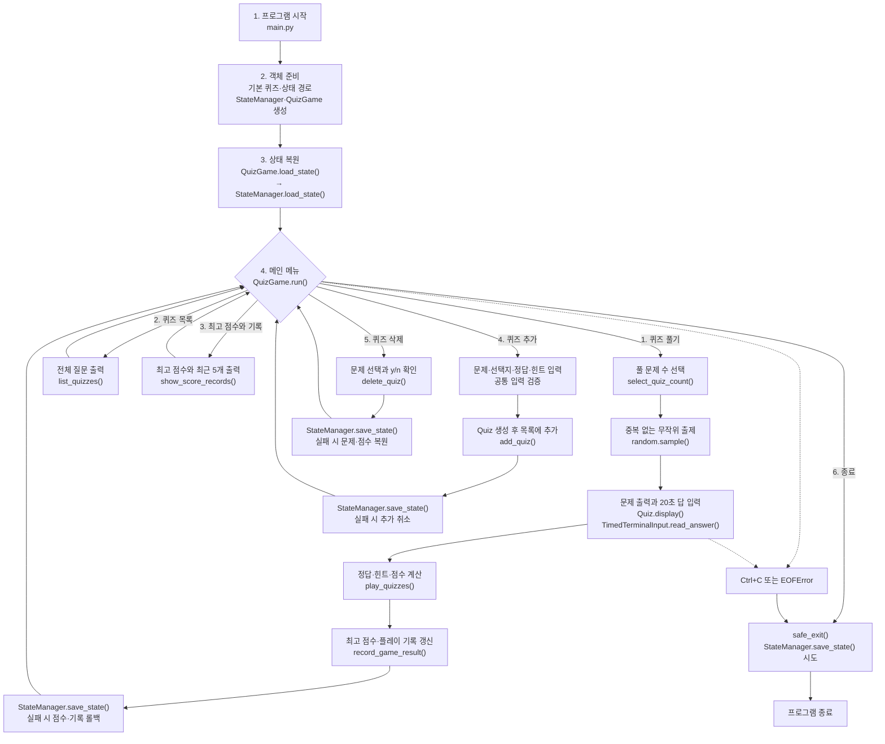
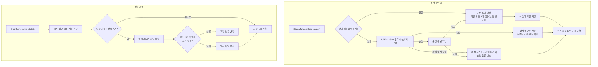

# E1-2 나만의 퀴즈 게임

## 프로젝트 개요

Python 객체 지향 구조와 JSON 파일 입출력을 사용해 만든 터미널 기반 상식 퀴즈
게임이다. 사용자는 퀴즈를 풀거나 직접 추가·삭제할 수 있으며, 퀴즈와 최고 점수,
플레이 기록은 프로그램을 종료하고 다시 실행해도 유지된다.

## 퀴즈 주제와 선정 이유

- 주제: 과학과 역사를 포함한 종합 상식
- 선정 이유: 별도의 분야 선택 없이 여러 종류의 상식을 간단히 확인할 수 있기 때문
- 기본 데이터: 직접 작성한 4지선다형 상식 퀴즈 5개

## 개발 환경과 실행 방법

- 기준 환경: macOS, zsh
- Python 3.12.13 사용, Python 3.10 이상 지원
- Git 2.53.0
- 외부 라이브러리 없이 Python 표준 라이브러리만 사용

프로젝트 루트에서 다음 명령을 실행한다.

```zsh
python3 main.py
```

기본 실행은 프로젝트 루트의 `state.json`을 사용한다. 실제 데이터를 변경하지 않고
기능을 확인하려면 테스트 모드로 실행한다.

```zsh
QUIZ_STATE_MODE=test python3 main.py
```

테스트 모드는 Git에서 제외된 `state.test.json`만 읽고 쓴다. 환경 변수를 지정하지
않거나 `real`로 지정하면 실제 `state.json`을 사용한다.

## 주요 기능

### 필수 기능

| 기능 | 설명 |
|---|---|
| 메뉴 | 퀴즈 풀기, 목록, 점수, 추가, 삭제, 종료 기능을 선택한다. |
| 퀴즈 풀기 | 저장된 문제 중 원하는 문제 수를 선택해 푼다. |
| 퀴즈 추가 | 문제, 선택지 4개, 정답 번호와 힌트를 입력해 즉시 저장한다. |
| 퀴즈 목록 | 현재 저장된 모든 문제의 번호와 질문을 확인한다. |
| 최고 점수 | 지금까지 획득한 가장 높은 점수와 최근 플레이 기록을 확인한다. |
| 입력 검증 | 빈 입력, 문자 입력과 범위를 벗어난 숫자를 안내하고 다시 입력받는다. |
| 안전 종료 | 정상 종료, `Ctrl+C`, EOF에서 가능한 상태를 저장하고 종료한다. |
| JSON 영속성 | 퀴즈, 최고 점수와 플레이 기록을 종료 후에도 유지한다. |
| 손상 복구 | 손상된 JSON을 백업하고 기본 데이터로 실행을 복구한다. |

### 추가 기능

| 기능 | 설명 |
|---|---|
| 무작위 출제 | 원본 저장 순서를 바꾸지 않고 선택한 문제만 무작위로 출제한다. |
| 문제 수 선택 | 1개부터 전체 문제 수까지 원하는 풀이 수를 선택한다. |
| 제한 시간 | 문제마다 20초 제한 시간과 1초 단위 카운트다운을 제공한다. |
| 자동 힌트 | 10초가 지나면 문제별 힌트를 자동으로 공개한다. |
| 차등 점수 | 힌트 공개 전 정답은 3점, 공개 후 정답은 1점이다. |
| 퀴즈 삭제 | 문제를 선택하고 `y/n`으로 확인한 뒤 즉시 저장한다. |
| 플레이 기록 | 전체 기록을 저장하고 최근 5개를 최신순으로 보여준다. |

## 전체 게임 파이프라인

### 시작부터 메뉴 기능과 종료까지



| 단계 | 담당 | 수행 내용 |
|---|---|---|
| 1. 시작 | `main.py` | 실행 모드에 맞는 상태 경로를 정한다. |
| 2. 객체 준비 | `main.py` | 기본 퀴즈, `StateManager`, `QuizGame`을 생성해 연결한다. |
| 3. 상태 복원 | `StateManager` | JSON을 읽어 퀴즈·최고 점수·기록을 복원한다. |
| 4. 메뉴 반복 | `QuizGame` | 메뉴 입력을 검증하고 선택한 기능을 실행한다. |
| 5. 기능 수행 | `QuizGame`, `Quiz`, `TimedTerminalInput` | 플레이·조회·추가·삭제·점수 기능을 처리한다. |
| 6. 상태 반영 | `StateManager` | 추가·삭제·플레이 결과를 JSON에 저장한다. |
| 7. 종료 | `QuizGame.safe_exit()` | 정상 종료나 입력 중단에서 저장을 시도하고 종료한다. |

### 상태 불러오기와 저장 파이프라인



`QuizGame`은 게임 진행 중 메모리 값을 관리하고, 파일 저장이 필요한 시점에만
`StateManager`를 호출한다. 추가·삭제·플레이 결과 저장이 실패하면 `QuizGame`이
변경 전 메모리 상태로 되돌려 파일과 현재 실행 상태가 달라지지 않게 한다.

## 동료평가 확인 순서

실제 `state.json`을 보호하기 위해 테스트 모드 실행을 권장한다.

1. `QUIZ_STATE_MODE=test python3 main.py`로 실행한다.
2. 메뉴에서 빈 값, 문자, 범위 밖 숫자를 입력해 공통 입력 검증을 확인한다.
3. `4. 퀴즈 추가`에서 문제, 선택지 4개, 정답과 힌트를 등록한다.
4. `2. 퀴즈 목록 보기`에서 추가한 문제가 표시되는지 확인한다.
5. `1. 퀴즈 풀기`에서 문제 수를 선택해 무작위 출제와 점수 계산을 확인한다.
6. 한 문제에서 10초를 기다려 자동 힌트와 1점 처리를 확인한다.
7. `3. 최고 점수와 기록`에서 최고 점수와 최근 기록을 확인한다.
8. `6. 종료` 후 같은 명령으로 다시 실행해 추가 문제와 점수가 유지되는지 확인한다.
9. 필요하면 `5. 퀴즈 삭제`에서 취소와 삭제 흐름을 확인한다.

## 점수 정책

- 힌트 공개 전 정답: 3점
- 힌트 공개 후 정답: 1점
- 오답 또는 시간 초과: 0점
- 한 게임의 만점: `출제 문제 수 × 3점`
- 최고 점수: 각 플레이에서 실제로 획득한 점수끼리 비교한 최댓값

점수는 문제 수로 정규화하지 않는다. 더 많은 문제를 선택하면 얻을 수 있는 최대
점수가 커지므로, 높은 최고 점수를 목표로 할수록 많은 문제를 선택하는 구조다. 이는
현재 게임의 의도된 점수 정책이다.

## 객체와 파일의 역할

```text
main.py
  ├── 기본 퀴즈와 상태 파일 경로 준비
  ├── StateManager 생성
  └── QuizGame 실행
        ├── Quiz 목록과 점수 관리
        ├── 메뉴·입력·게임 진행
        ├── TimedTerminalInput으로 제한 시간 입력
        └── StateManager에 상태 저장·불러오기 위임
```

| 파일 | 책임 |
|---|---|
| `main.py` | 필요한 객체를 생성하고 게임을 시작하는 진입점 |
| `src/quiz.py` | `Quiz` 데이터 검증, 출력, 정답 확인과 JSON 변환 |
| `src/game_manager.py` | 메뉴, 입력, 퀴즈 진행, 추가·삭제와 점수 처리 |
| `src/state_manager.py` | 상태 경로, JSON 저장·검증·이전·백업과 복구 |
| `src/timed_input.py` | 제한 시간 답 입력, 카운트다운과 자동 힌트 |
| `src/default_quizzes.py` | 상태 파일이 없거나 손상됐을 때 사용할 기본 문제 |

`QuizGame`은 게임 진행을, `StateManager`는 파일 상태 관리를 맡는다. `QuizGame`의
`save_state()`는 퀴즈·최고 점수·플레이 기록을 `StateManager`에 직접 전달하고,
`load_state()`는 같은 세 값을 돌려받아 현재 게임에 반영한다. 실제 파일 처리는
`StateManager`가 담당한다.

이 구조는 한 클래스가 게임 흐름과 파일 복구를 모두 처리하지 않도록 책임을 나눈다.
또한 `QuizGame` 생성 시 `StateManager`를 전달할 수 있어 실제 파일과 분리한 상태
검증이 가능하다.

## 프로젝트 구조

```text
.
├── main.py
├── src/
│   ├── __init__.py
│   ├── quiz.py
│   ├── game_manager.py
│   ├── state_manager.py
│   ├── timed_input.py
│   └── default_quizzes.py
├── state.json
├── README.md
├── docs/
│   ├── architecture-plan.md
│   ├── requirements.md
│   ├── progress.md
│   ├── worklog.md
│   └── troubleshooting.md
└── evidence/
    ├── git/
    ├── logs/
    └── screenshots/
```

## 데이터 저장

### 파일 경로와 용도

| 파일 | 용도 | Git 추적 |
|---|---|---|
| `state.json` | 실제 퀴즈, 최고 점수와 플레이 기록 | 추적 |
| `state.test.json` | 동료평가와 직접 기능 확인용 상태 | 제외 |
| `*.corrupt-*` | 손상 복구 전에 보존한 원본 상태 | 제외 |

경로는 현재 터미널 위치가 아니라 프로젝트 루트를 기준으로 계산한다. JSON은 UTF-8,
한글 유지, 들여쓰기 2칸 형식으로 저장한다.

### JSON 스키마

```json
{
  "quizzes": [
    {
      "question": "문제 내용",
      "choices": ["선택지 1", "선택지 2", "선택지 3", "선택지 4"],
      "answer": 1,
      "hint": "문제별 힌트"
    }
  ],
  "best_score": 7,
  "score_history": [
    {
      "played_at": "2026-08-05 21:34",
      "score": 4,
      "max_score": 6,
      "correct_count": 2,
      "total_count": 2,
      "hint_count": 1
    }
  ]
}
```

- `quizzes`: 퀴즈 객체 목록
- `best_score`: 아직 플레이하지 않았으면 `null`, 이후 0 이상의 최고 획득 점수
- `score_history`: 완료한 모든 플레이 기록
- `answer`: 1부터 4 사이의 정수
- `played_at`: `YYYY-MM-DD HH:MM` 형식의 로컬 시각

## 저장 실패와 손상 복구

- 상태는 임시 파일에 먼저 쓴 뒤 활성 상태 파일로 교체한다.
- 퀴즈 추가·삭제 또는 플레이 기록 저장이 실패하면 메모리 변경도 되돌린다.
- 상태 파일이 없으면 기본 퀴즈 5개로 새 파일을 만든다.
- JSON 문법이나 필드 형식이 잘못되면 오류 원인을 안내한다.
- 손상 원본은 `상태파일명.corrupt-YYYYMMDD-HHMMSS-ffffff`로 백업한다.
- 백업 후 기본 퀴즈, 빈 최고 점수와 빈 기록으로 활성 파일을 복구한다.
- 백업에 실패하면 원본 보호를 위해 해당 실행의 저장을 중지한다.

## Git과 실행 증거

- 공개 저장소: <https://github.com/naktaa/Codyssey-E1-2-python-quiz>
- 통합 브랜치: `main`
- 기능 브랜치 작업과 병합 기록 보유
- 의미 있는 커밋 10개 이상 보유

| 확인 내용 | 자료 |
|---|---|
| 초기 환경과 Git 설정 | [Git 확인 기록](evidence/git/git-verification.md) |
| 현재 메뉴 | [메뉴 화면](evidence/screenshots/main-menu.png) |
| 제한 시간·자동 힌트 플레이 | [게임 화면](evidence/screenshots/game-play.png) |
| 안전 종료 | [안전 종료 기록](evidence/logs/safe-exit.md) |
| 최고 점수 재실행 유지 | [영속성 기록](evidence/logs/persistence-restart.md) |
| 손상 JSON 백업·복구 | [복구 기록](evidence/logs/json-recovery.md) |

개발 과정과 요구사항별 검증 상태는 다음 문서에서 확인할 수 있다.

- [아키텍처와 구현 기준](docs/architecture-plan.md)
- [요구사항 추적표](docs/requirements.md)
- [현재 진행 상태](docs/progress.md)
- [작업 기록](docs/worklog.md)
- [문제 해결 기록](docs/troubleshooting.md)
